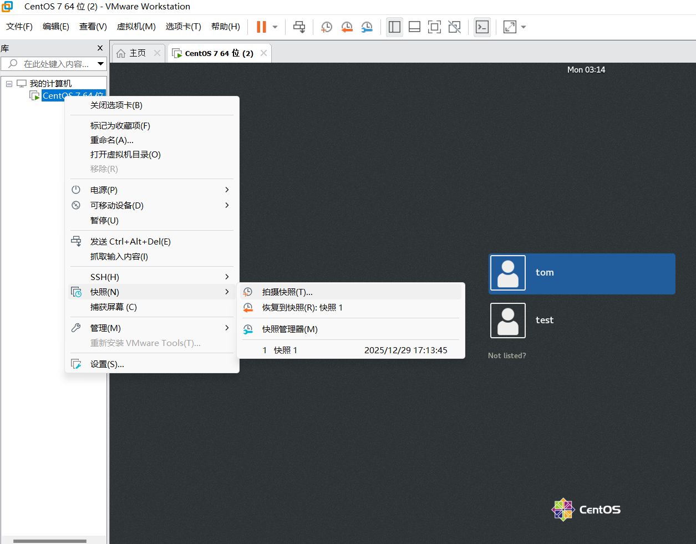
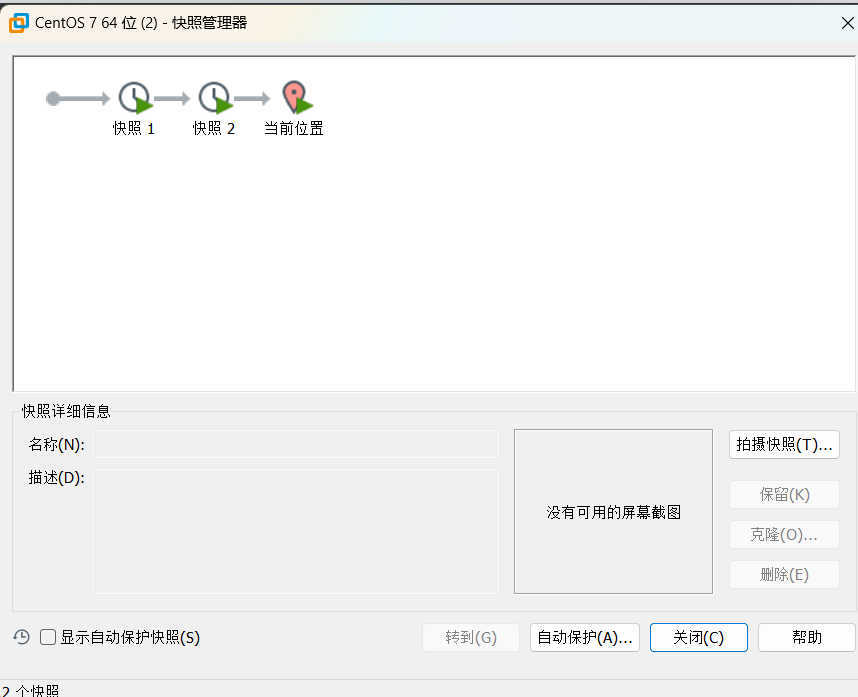
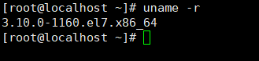
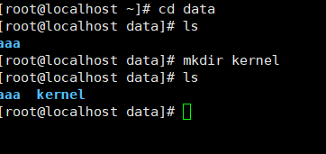

# Linux内核升级
## 系统备份

系统备份

拍摄快照

快照管理器

查看内核版本

`uname -r`

备份boot 和 etc

`cp -r /boot/ /boot_backup_2026-1-12`

`cp -r /etc/ /etc_backup_2026-1-12`

### CentOS:

更新现有的软件：

`yum update -y`

CentOS8以上

`dnf update -y`

安装最新版本

因为CentOS7官方已经不维护了，需要自己去官网下载内核。

创建放置内核的目录kernel

**需要下载-lt 和 -devel 的包**

`weget 下载地址` 

**安装下载的包**

`rpm -Uvh kernel-lt.***********`

`rpm -Uvh kernel-lt-devel.***********`

在启动时使用新内核

`grub2-set-default 0`

重启

`reboot`

清理旧内核

`packeage-cleanup --oldkernels --count=1`

### Ubuntu

更新现有的软件：

`apt update`

安装最新版本

`apt install linux-image-generic -y`

清理旧内核

`apt autoremove --purge` 

