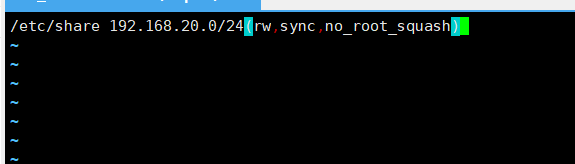
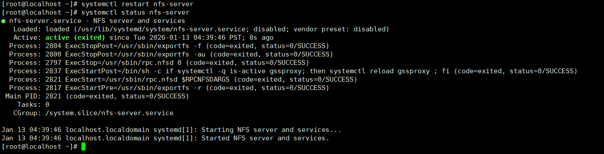
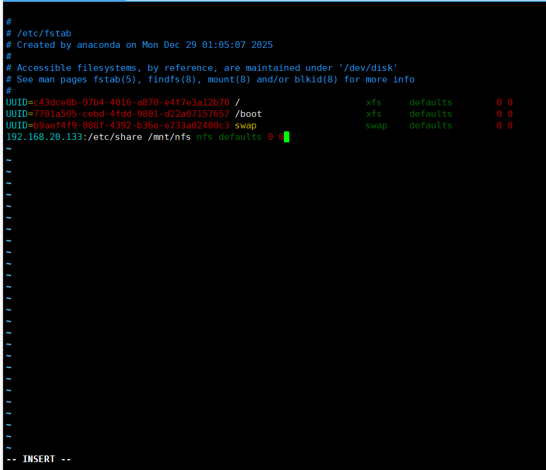

# NFS网络文件系统

nfs是**跨平台的文件共享协议**，像在网络上的一个盘，不同系统的用户都可以访问。

**集中式存储管理**，一个节点多个客户端

## 配置nfs服务端

### 安装软件包
`yum install nfs-utils -y`

### 创建共享文件夹

在根目录下创建etc/share

### 设置nfs配置文件

**节点设置**

图中

共享文件夹位置/etc/share

可访问的网段 192.16820.0/24

（rw,sync,no_root_squash）内是权限，rw是读写，sync同步写入磁盘，no_root_sqush客户端为root权限

重启，查看状态

设置开机自启

`systemctl enable nfs-server`

**客户端设置**

创建本机访问位置，客户端访问共享文件会通过/mnt/nfs

`mkdir /mnt/nfs`

挂载共享文件

`mount -t nfs 192.168.20.133:/etc/share /mnt/nfs`

192.168.20.133是节点的ip地址

/etc/share是共享文件夹

没有挂载上可能是节点的防火墙未关。

进行永久挂载，开机自动链接

`vim /etc/fstab`

加载 /etc/fstab 中所有未挂载的文件系统

`mount -a`

查看磁盘情况

`df -h`

