# Linux文本管理命令

# grep命令

高亮指定文件内大的指定字符

""内为指定字符

message是指定文件
`grep "error" message`

`grep "install" anaconda-ks.cfg`

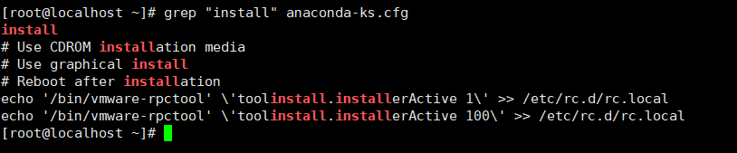

忽略大小写
`grep -i "error" message`

`grep -i "install" anaconda-ks.cfg`

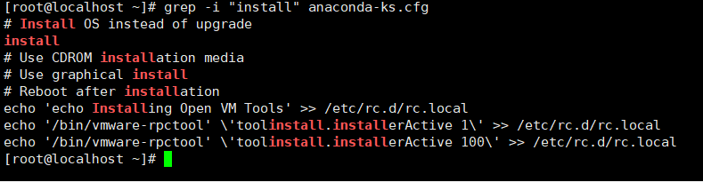

反向匹配，排除含有指定字符的内容

如在message文件中排除还有error的内容

`grep -v "error" message`

 查找本地hosts的配置

`grep "127.0.0.1" /etc/hosts`

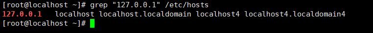

多文件的搜索

`grep "A" /var/log/nginx/access.log-20260113 /var/log/nginx/error.log-20260113`

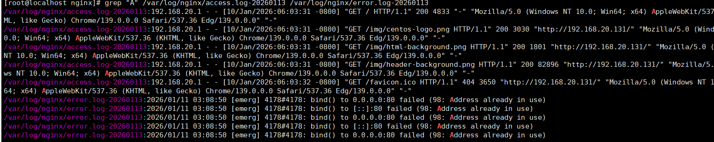

递归搜索

`grep -r "function" /`

查找根目录下的带有function的文件

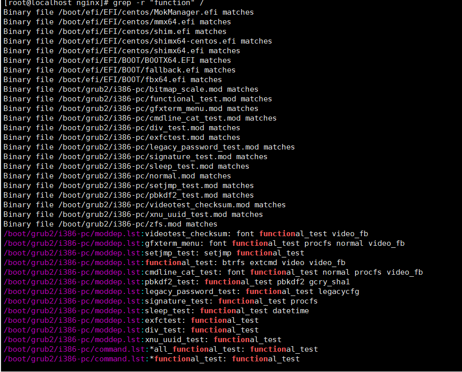

这里
`grep -r --include="*.js" "console.log"`

没有反应
通过查找.js文件发现

`find / -name "*.js"`

有很多.js文件，

则应该是nginx下的所有js文件中未包含console.log文件

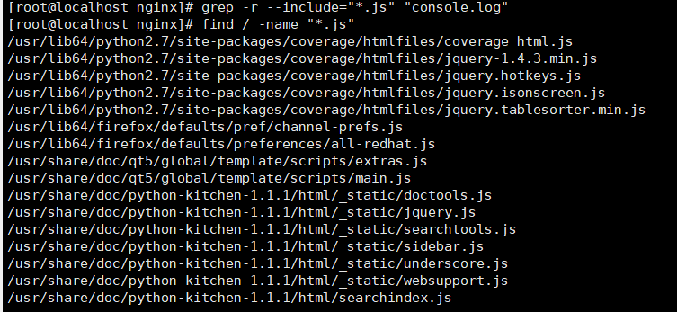

这里调整到根目录下

` grep -r --include="*.js" "console.log" /`

/换成.是当前目录

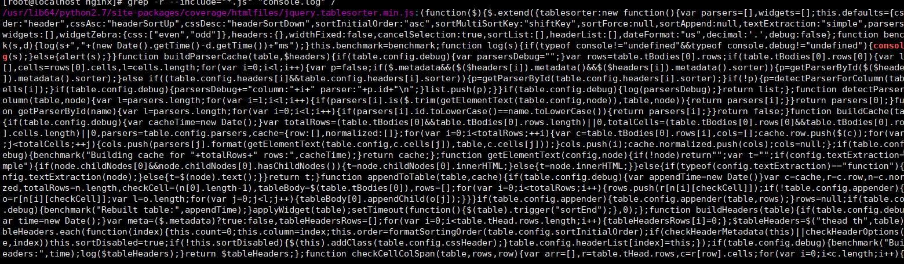

## 正则表达式的运用

这是测试文本test.sh的内容

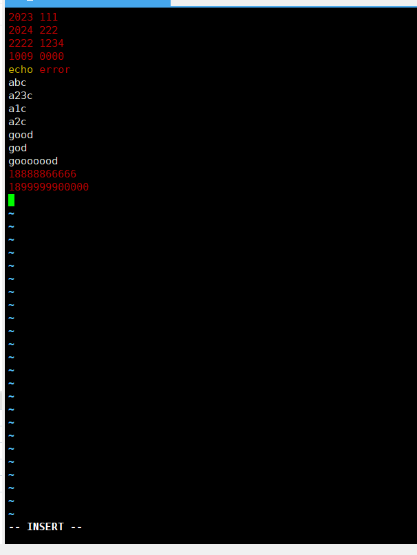

**这里的-n是显示详细位置几行，可以不加**

以2023开头的位置

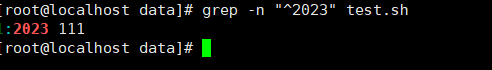

以111结尾的

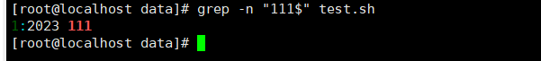

以000结尾

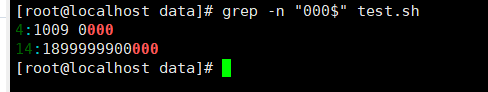

a.c
以a开头中间一个任意字符，c结尾

a..c

中间两个任意字符

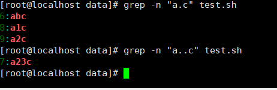

a*c，**\*表示前一个单词可以出现0次以上**

同样
g*d

前一个任意字符.可以出现0次以上！

a.*c

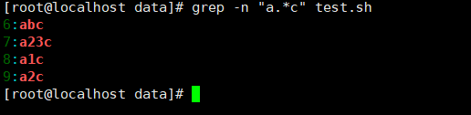

每11位数字匹配一次（检测11位，能到11位即输出，22位匹配两次，以此类推）

`grep -P "\d{11}" test.sh`

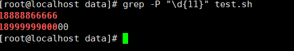

`grep -P "\d{4}" test.sh`

这里8位以上的数字，匹配了2次，所以是每4位匹配一次

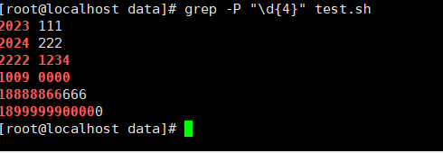

a?c 匹配前一个字符0/1

与管道符号配合

查询nginx的进程数

`ps -aux | grep nginx`

-C（大写）连带上下文输出

在test.sh文件中，匹配到abc，输出上下三行内容

`grep -C 3 "abc" test.sh`

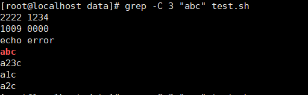

-A连带下文输出

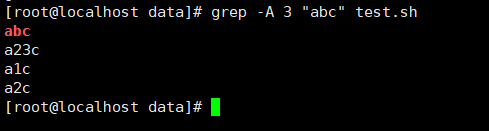

-B连带上文输出

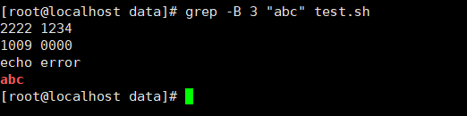

统计空行数

-c（小写）输出个数

`grep -c "^$" test.sh`

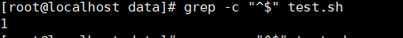

 ## 查找ip地址

 `grep -oE "\b([0-9]{1,3}\.){3}[0-9]{1,3}\b" access.log`

 **-o** 只输出匹配到的部分
**-E** 扩展正则表达式（无需对（），{}等符号转义）

**\b** 单词边界，匹配到完整后输出

**([0-9]{1,3})** 匹配1-3位数字，每位数字范围是[0,9]

"."匹配.号

**{3}** 组合3次

## 高亮

在access.log文件中高亮WARNING

`grep --color=auto "WARNING" access.log`

## 转义字符

可以看到有

test.kkk$

用"test.kkk"能匹配到

"test.kkk$"和"test.kkk/$"都无法匹配
因为$是特殊符号，行尾标识符，放行尾会被文本忽略掉

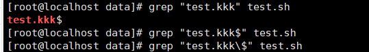

"test.kkk"和"test/.kkk"都能匹配

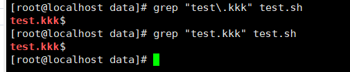

**出现乱码情况**
--binary-files=text，强制作为文本处理，可能会出现乱码无法匹配成功

`grep --binary-files=text "啊啊" test.sh`

要进行转码

## 匹配文件定位

找到注释行

`grep "^#" test.sh`
-v 反向匹配

# find命令

`find data -name "*.sh"`

在data目录下查找.sh文件

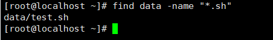

`find data -name "*.sh" -delete`

对该文件进行删除

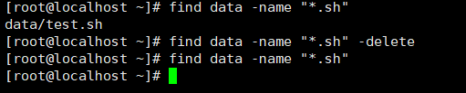

`find.-name "filename"`

快速查找当前目录下文件名为filename的文件

**-iname 不区分大小写**

`find.-iname "filename"`

排除某些文件名,
这里是在data目录下查找文件类型为.sh，并排除文件名中含有mirrorlist的文件

`find data -name "*.sh" -not -name "*mirrorlist*"`

## 根据文件类型查找

**直接查找文件**

查找文件类型为jpg的文件

`find / -type f -name "*.jpg"`

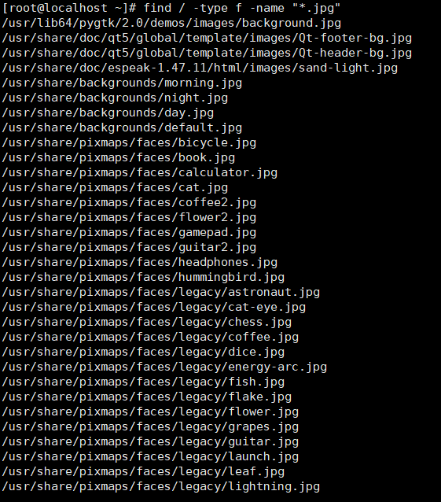

查找根目录下名为log的目录

`find / -type d -name "log"`

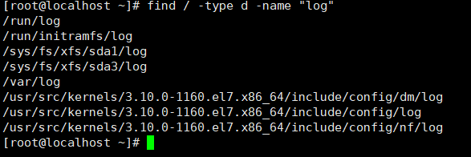

查找链接

`find / -type l`

## 根据文件大小查找

查找根目录下的文件大于50MB

`find / -size +50M`

查找文件大小小于10KB的文件

`find / -size -10k`

## 搜索最近修改的文件

查找最近7天修改的文件

`find / -mtime -7`

最近1天内修改过的log文件

`find /var/log -mtime -1`

组合查找根目录下目录名为log并最近7天被修改过的目录

`find / -type d -name "log" -mtime -7 `

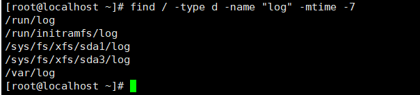

最近100天内没有被打开过的文件

`find / -atime +100`

搜索最近1天内创建的文件

`find / -ctime -1`

结合
-and ，-or ，-not实现复杂的查找

查找tmp文件与bak文件

`find / -name "*tmp" -or -name "*.bak"`

查找既是tmp文件也是bak文件

`find / -name "*tmp" -and -name "*.bak"`

这里的-exec 是执行的意思

执行 gzip 压缩

{} 指前面查找到的内容

\;指结束符

`find / -type d -name "log" -mtime -7 -exec gzip {} \;`

执行前

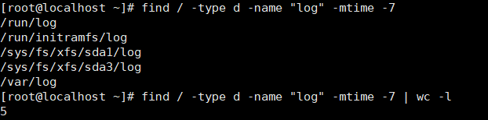

执行后

因为都是目录无法压缩
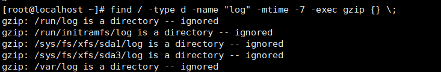

查找空目录

`find /root/data -type d -empty`

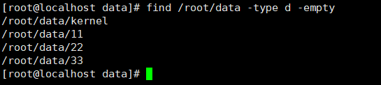

删除查找到的内容

`find /root/data -type d -empty -exec rmdir {} \;`

找到后删除，再去找，无法找到

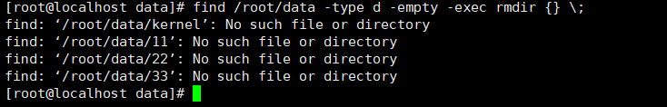

# sed命令
1、流式文本编辑器，
2、不修改源文件，
3、支持正则表达式，
4、可多操作组合

## 替换操作

`sed 's/222/qwe/' 1.txt`

 将1.txt文件中的222替换成qwe，并不是实际更改，
 再次cat 1.txt 内容并未更改

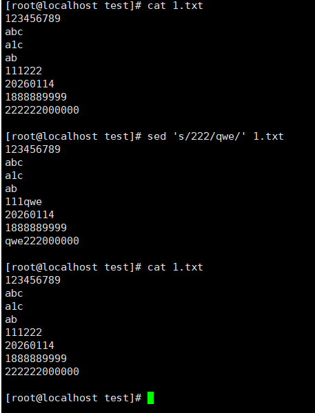

`sed 's/222/qwer/' 1.txt`

随意替换没有字符对应的限制

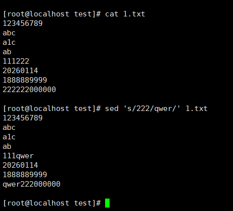

实际更改

`sed -i 's/222/qwe/' 1.txt`

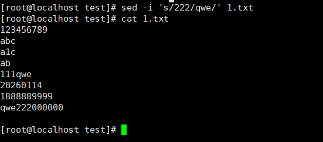

`sed 's/111/xyz/' 1.txt`

只会更改每一行第一次匹配成功的字符

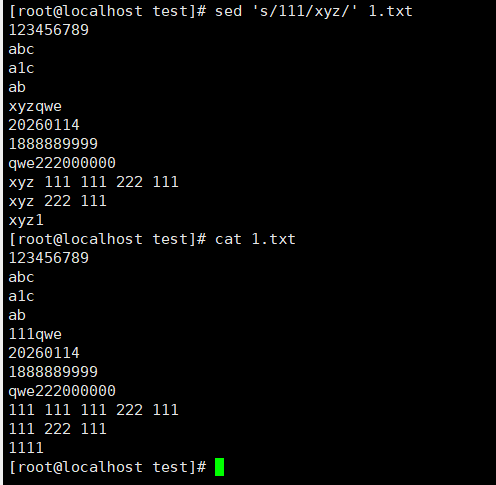

 `sed 's/111/xyz/g' 1.txt`

 g进行全局替换

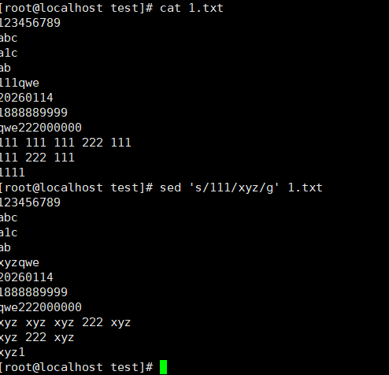

涉及特殊转移字符"/"

`sed 's#/data/etc/mnt#/home/test/time#' 1.txt`

#被替换内容 # 替换内容 #

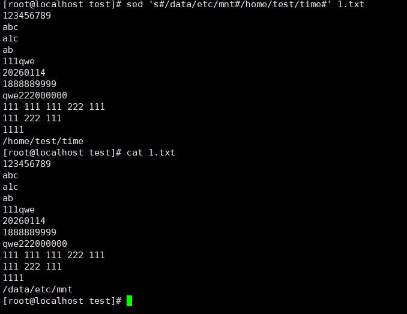

给所有数字加上[]

`sed 's/[0-9]\+/[&]/g`

用&来指代数字
替换格式：s/ / /

[0-9]\+至少匹配一次数字

[&]指代前面匹配的数字

g全局替换

`sed -E 's/([0-9]{4})-([0-9]{2})-([0-9]{2})/\3\/\2\/\1/' 2.txt`

sed -E 's/(1号匹配内容)-(2号匹配内容)-(3号匹配内容)/\3号匹配内容\/\2号匹配内容\/\1号匹配内容/' 2.txt

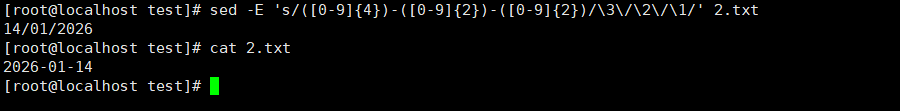

用/分割**匹配内容**与**替换内容**

-E是扩展使用正则表达式

`sed '/error/ s/error/ERROR/g' 3.txt`

前一个/error/是条件

检查还有error的行，只替换有error的行，没有的不变直接输出。

` sed 's/error/ERROR/g' 3.txt` 

检查替换所有行

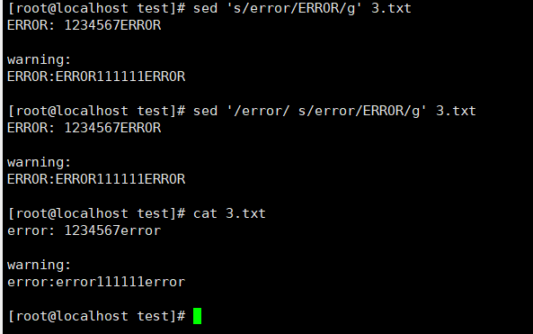

`sed '/error/ s/error/ERROR/g; s/line/LINE/' 3.txt`
/error/的条件限制是对s/error/ERROR/g;，不影响s/line/LINE/

`sed '/error/ {s/error/ERROR/g; s/line/LINE/;}' 3.txt`

这里{s/error/ERROR/g; s/line/LINE/;}放在同一个块中，是一起判定的。

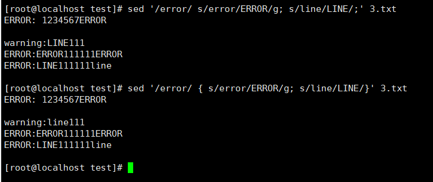

**行范围替换**

` sed '5,$ s/error/ERROR/g' 3.txt`

从第五行开始，进行替换

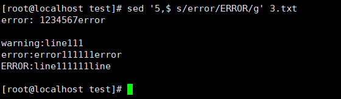

## 删除操作

删除空行

`sed '/^$/d' 3.txt`

^开头，$结尾，d是删除

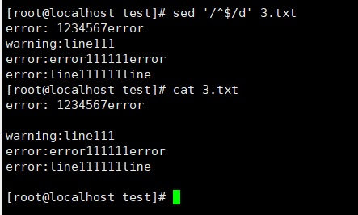

删除特定字符

`sed '/111/d' 3.txt`

只要匹配到111的行都删除

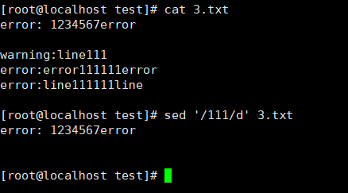

范围删除

删除指定行范围

`sed '3,5d' 3.txt`

删除3到5行

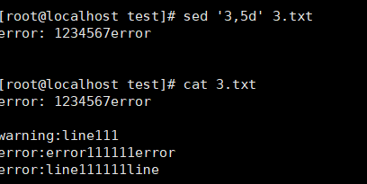

`sed '/error/,/warning/d' 3.txt`
从匹配到error到匹配到warning的行

删除从error到warning

第1行到第3行，匹配到error和warning

第7行到最后一行，匹配到error，未匹配到warning，
也删除

反向删除

!d仅留下匹配内容

`sed '/[0-9]/!d'  3.txt`

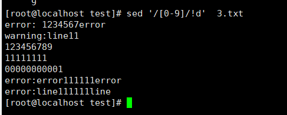

## 添加/插入内容（a/i命令）

`sed '/line/a test' 3.txt`

a插入一行，匹配line所在行，在其下一行插入一行test 

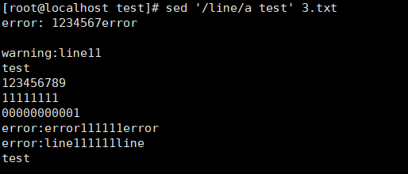

添加多行内容

\为换行符，能够输入多行的内容

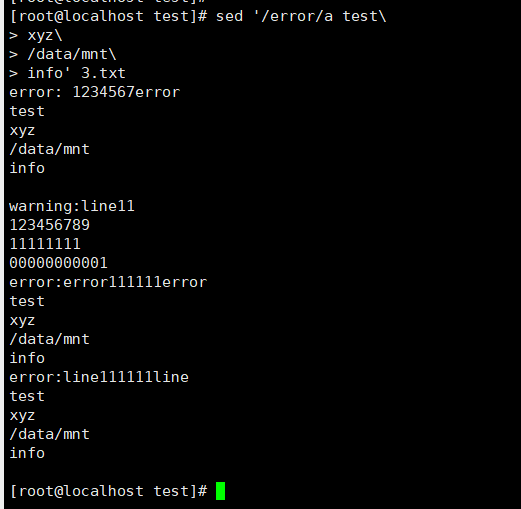

在最后一行添加内容

`sed '$a 这是追加内容' 3.txt`

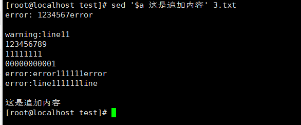

插入内容（i命令）

1i是开头

`sed '1i 这里是追加内容' 3.txt`

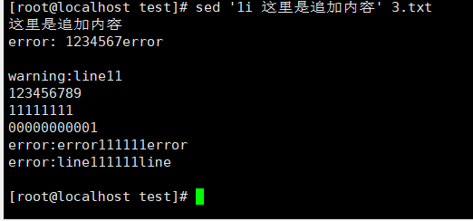

在某一单词前插入空行

`sed '/line/i\ '$'\n' 3.txt`

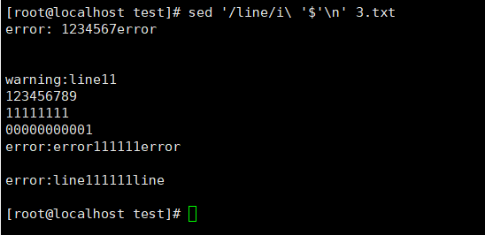

'$'\n是换行符，也可以是\n

-e 执行多个替换

`sed -e 's/Apple/苹果/g' -e 's/Orange/橘子/g' 3.txt`

使用转义

 \/ ，\& ，\\

 处理大文件

 每次处理N行，暂停。

 生成8位的随机密码

date时间，

md5sum生成32位哈希，根据时间变动

sed 's/[^a-zA-Z0-9]//g'去掉空格和-

cut -c1-8截取前8位

 `date | md5sum | sed 's/[^a-zA-Z0-9]//g' | cut -c1-8`

 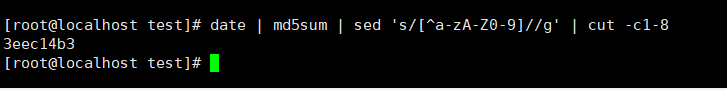
 