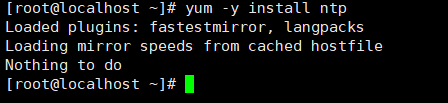
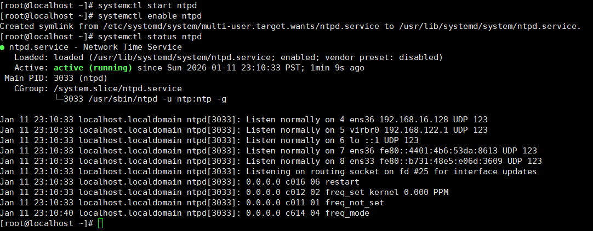
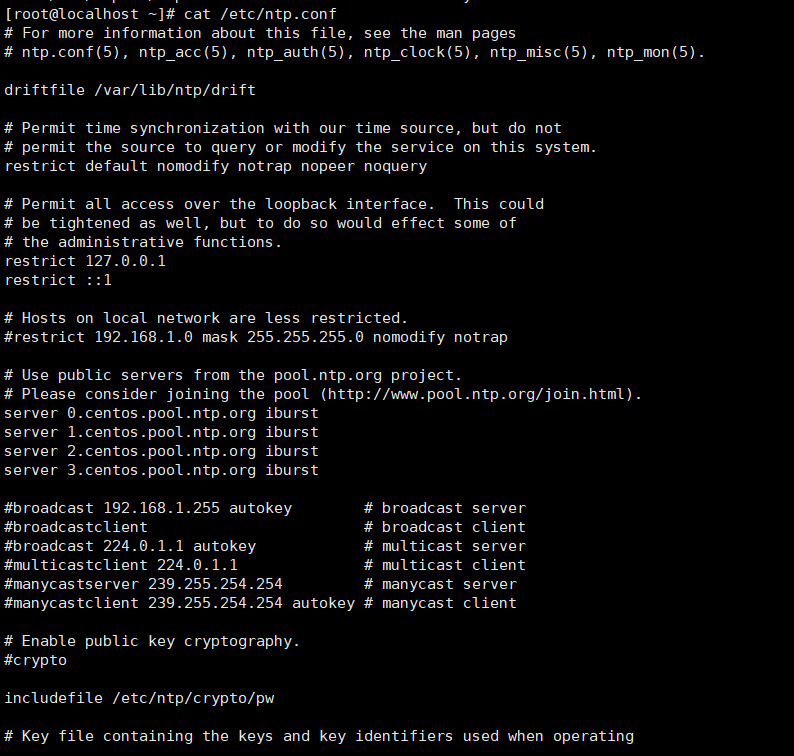
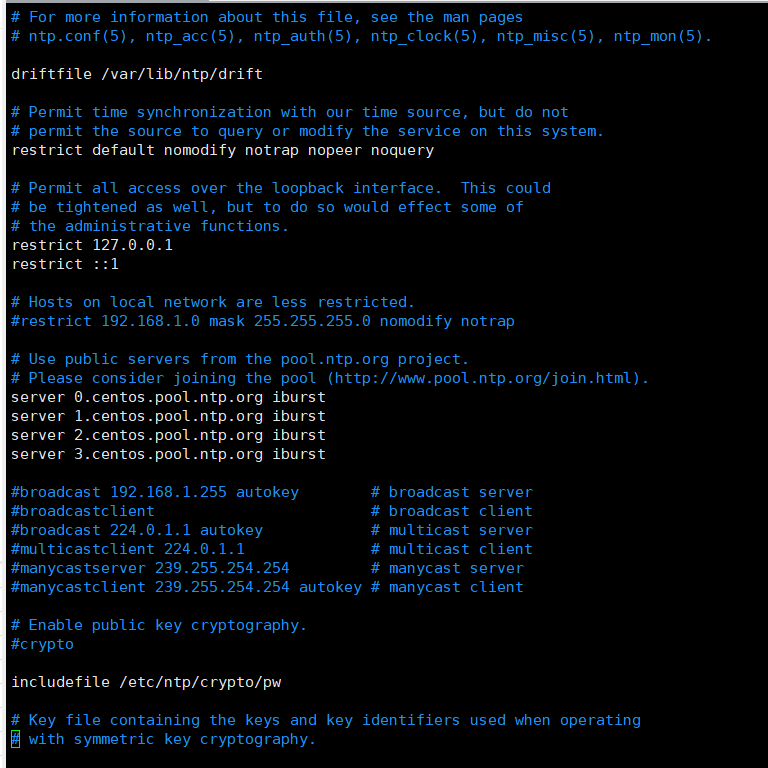
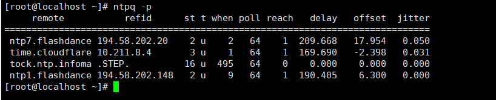
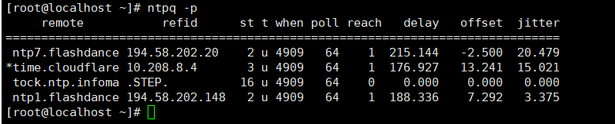
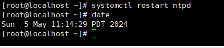
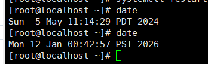
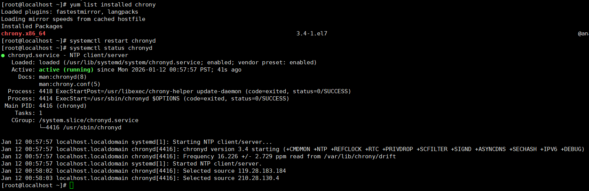
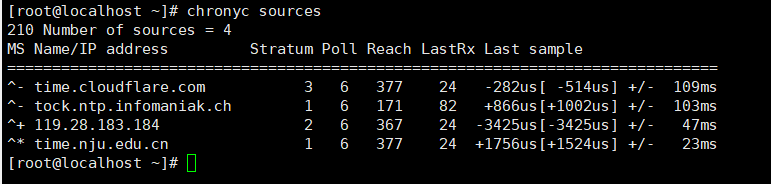

# Linux

## Linux时间同步

### NTP服务配置详解
安装NTP服务

CentOS服务名是ntpd

`yum -y ntp`

这里已经安装过了

开机自启

先重启ntp

`systemctl restart ntpd`

设置自启动

`systemctl enable ntpd`

查看服务状态

`systemctl status ntpd`

查看文件配置

`cat /etc/ntp.conf`

`vim  /etc/ntp.conf`
编辑文件配置

这里的service0-3 是默认的时间服务器
可以自行配置时间服务器

配置好后`systemctl restart ntpd` 重启服务

查看同步内容

`ntpq -p `

查看时间
`date`

更改时间

`date -s "2024-05-05 11:12:13"`

查看同步时间,发现相差时间巨大

重启ntp服务，同步时间，发现还未更新，有延迟。

*同步流程*：

   （**请求同步时间**）
主机——————————————>服务器

 (**返回同步具体时间**)
主机<——————————————服务器

在返回时有延迟，造成了时间不一致，等一会发现已同步

### Chrony时间同步
在CentOS中使用
`yum install chrony`安装

查看是否安装成功

`yum list install chrony`

启动chrony
`systemctl restart chronyd`

查看chrony状态

`systemctl status chronyd`

查看实时状态

`chronyc tracking`

查看使用的参考时钟

`chronyc source`

### ntp与chrony的选择

网络要求高，要微秒级，chrony

ntp一般用到物理机