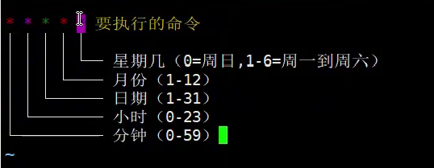
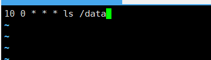
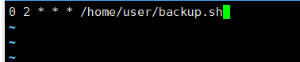
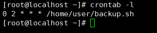
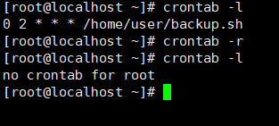
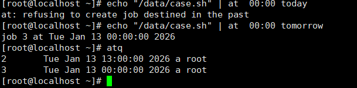
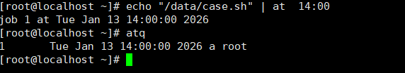
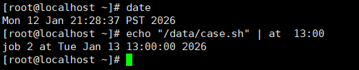
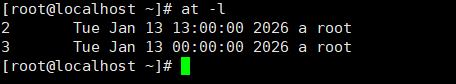
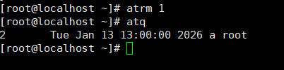

# 计划任务
需要在特定时间或条件下自动执行的操作和程序

## Cron定时任务

根据指定的时间，自动运行命令和脚本

常用完成周期性任务

**编辑任务**

`crontab -e`

进入到编写页面

命令格式

如

每天0点10分 执行 ls /data

10 0 * * * ls /data

每天2点0分 执行 /home/user/backup.sh

0 2 * * * /home/user/backup.sh

**查看定时任务**

**删除编辑任务**

## AT命令
在特定时间执行一次命令

在14：00执行/data/case.sh
` echo "/data/case.sh" | at  14:00`

**00：00算在明天**

` echo "/data/case.sh" | at  00:00 today`

`echo "/data/case.sh" | at  00:00 tomorrow`

**查看任务列表**

`atq`

可以看到当前时间是2026-01-12 21:28:37

设定在13：00执行，超过当前时间，自动改为明天，也就是2026-01-13 13：00

查看后续要执行的任务

`at -l`

**删除1号任务**

`atrm 1`

或

`at -d 1`

查看任务列表，只剩下2号任务

*当任务执行完后将不会显示该任务*

